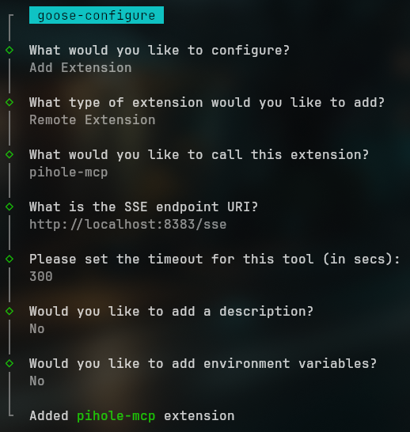
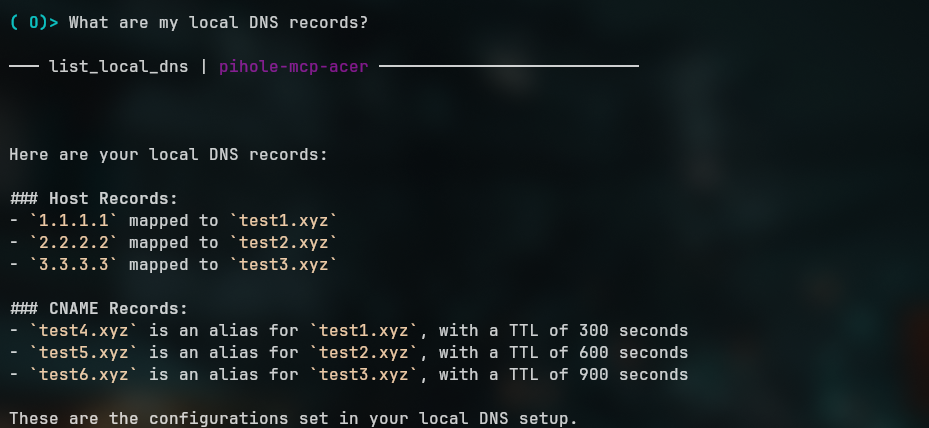
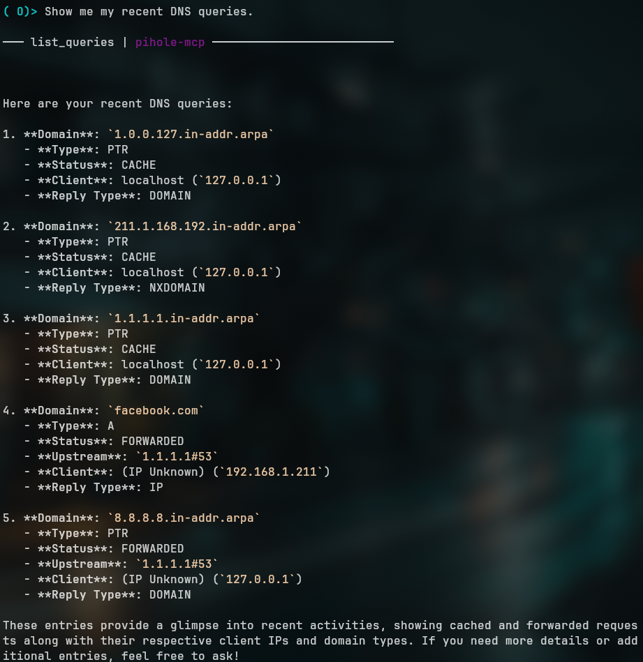
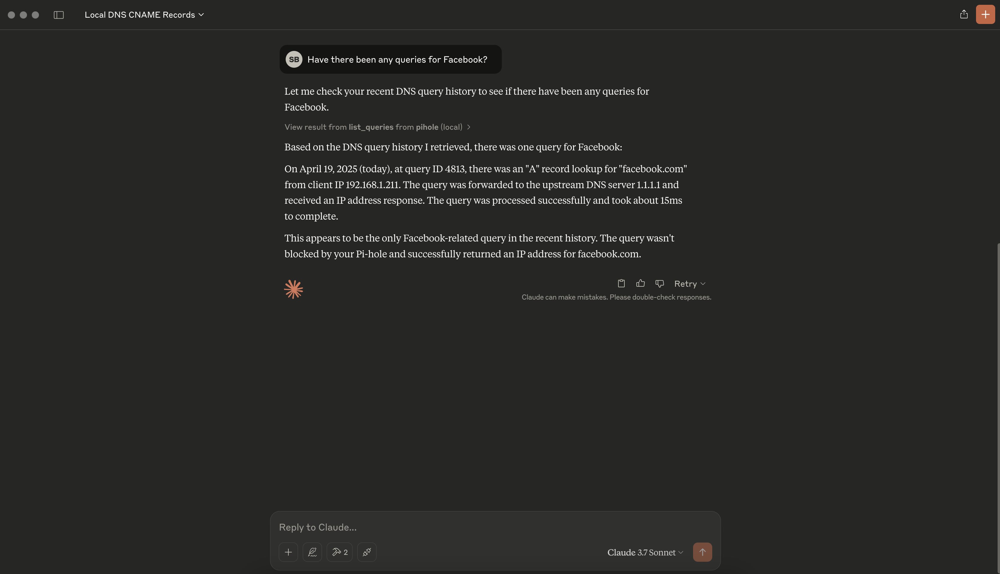

# pihole-mcp-serer

A Model Context Protocol (MCP) server for Pi-hole. This server exposes Pi-hole functionality as tools that can be used by AI assistants.

## Features

- **ListLocalDNS**: Returns all local DNS settings from Pi-hole
- **ListQueries**: Returns recent DNS query history from Pi-hole
- _...more to come..._

## Dependencies

### Docker

- [Docker install guide](https://docs.docker.com/engine/install/)

## Environment

Create a `.env` file in the project root with your Pi-hole credentials:
```
PIHOLE_URL=https://your-pihole.local/
PIHOLE_PASSWORD=your-admin-password
```

## Docker Deployment

Run the Pi-hole MCP server in Docker.

### Using Docker Compose

1. Pull and start the container:
   ```
   docker-compose up -d
   ```

2. The server will be available at `http://localhost:8383`

### Manual Docker Build

Alternatively, you can build and run the Docker container manually:

```
docker build -t pihole-mcp .
docker run -p 8383:8000 --env-file .env -d pihole-mcp
```

## API

This MCP server exposes two tools:

- `list_local_dns`: Lists all local DNS settings from Pi-hole
- `list_queries`: Fetches the recent DNS query history from Pi-hole

## Testing in `goose`

Goose is a CLI LLM client that's useful for testing and development. Follow their install instructions [here](https://block.github.io/goose/docs/quickstart/).

The following assumes you've completed the initial setup with `goose configure`.

### Configure Extension

1. Type `goose configure` to open the configuration menu.
2. Select **Add Extension**
3. Select **Remote Extension**
4. It will ask for a name. It doesn't matter what you name it. I called mine `pihole-mcp`.
5. When it asks _"What is the SSE endpoint URI?"_ enter `http://localhost:8383/sse`.
6. Enter a timeout.
7. Add a description if you'd like.
8. Select **No** when it asks about environment variables.
   

### Start a Session

Once the server is installed, start a chat session.

```sh
goose session
```

Try asking it: _"What are my local DNS records?"_



...or telling it: _"Show me my recent DNS queries."_



## Claude Desktop

Claude's desktop client currently only support's the STDIO protocol, however you can use a proxy to communicate with the SSE endpoint.

Add the following to your `claude_desktop_config.json` file.

```json
{
  "mcpServers": {
    "pihole": {
      "command": "npx",
      "args": [
        "mcp-remote",
        "http://localhost:8383/sse"
      ]
    }
  }
}
```

If you're connecting to a different host on your local network and using an unsecured connection, you'll need to explicitly allow it with the `--allow-http` argument. For example:

```json
{
  "mcpServers": {
    "pihole": {
      "command": "npx",
      "args": [
        "mcp-remote",
        "http://192.168.1.255:8383/sse",
        "--allow-http"
      ]
    }
  }
}
```

Afterwards, completely restart the application and try it out.




## License

[MIT](./LICENSE)